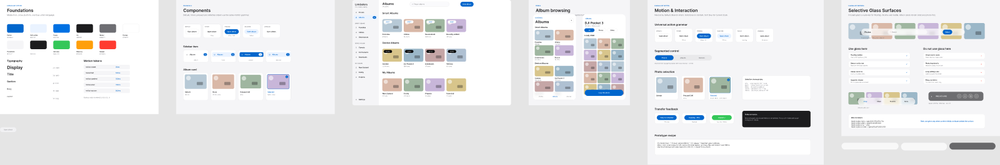

# LinkGallery

**English** | [简体中文](README.zh-CN.md)

> One gallery. Every device.

LinkGallery is a local-first media browser that turns Windows into one place for viewing and saving
photos and videos from personal devices. The current alpha connects a Windows desktop application to
an Android phone over the local network.

[](https://github.com/xyan1773/LinkGallery/actions/workflows/ci.yml)

## Inspiration

LinkGallery began with a simple frustration: Microsoft Phone Link makes recent Android photos
available on Windows, but it does not feel like a complete gallery for a larger personal media
library.

I wanted to browse a timeline, understand which album and device each item came from, preview media,
and save selected originals to Windows without switching between disconnected tools. I also wanted
the design to grow beyond one phone. Personal media can come from Android, Windows folders, DJI
Pocket cameras, SD cards, external drives, NAS devices, and, eventually, other platforms.

After looking for a project that matched that product idea, I decided to build LinkGallery around one
goal:

> Use Windows as a unified terminal for browsing and managing media from different personal devices.

## What it does today

The current Android-to-Windows prototype supports:

- discovering Android devices on the local network and remembering paired devices;
- reading Android photos, videos, albums, and metadata through MediaStore;
- browsing a Windows timeline with pagination, filters, albums, cached thumbnails, and an offline
  SQLite index;
- previewing photos and playing videos;
- copying selected original files to Windows with persistent jobs, `.partial` files, resume support,
  range validation, and safe final publication;
- recognizing selected DJI Pocket 3 and DJI Mimo media characteristics;
- sharing one versioned OpenAPI contract between the Android and Windows implementations.

The phone remains a **read-only media source**. LinkGallery does not expose operations that delete,
move, rename, edit, or upload media on Android.

## Product principles

- **Local first.** Media browsing and transfer stay on the local network; there is no cloud service.
- **Read-only at the source.** The Android companion only exposes metadata, thumbnails, and original
  read streams.
- **Windows owns file output.** Destination paths, duplicate handling, transfer state, and final file
  publication are controlled by the desktop application.
- **Failures must be recoverable.** Interrupted transfers resume from temporary files and must never
  leave a damaged file that looks complete.
- **Device-specific behavior stays behind adapters.** The gallery should not need to be rebuilt for
  every future media source.

## Design preview

The repository includes an early product and component exploration. It uses synthetic placeholder
content rather than a real personal photo library.



## Architecture

```text
Windows WPF application
  ├─ timeline, albums, previews, and transfer UI
  ├─ SQLite media index and thumbnail cache
  ├─ device discovery and paired-device storage
  └─ reliable copy and resume coordination
                 │
        local HTTP API + Range
                 │
Android companion
  ├─ MediaStore metadata and content streams
  ├─ authenticated read-only HTTP routes
  ├─ pairing and local credential storage
  └─ NSD/mDNS and UDP discovery
```

The desktop code follows a layered structure:

```text
Desktop / Infrastructure → Application → Domain
```

The Android application separates media access, discovery, pairing, server, identity, and UI code so
that platform behavior does not leak into the shared protocol.

## Repository layout

```text
LinkGallery/
├── desktop/          # C#, .NET 8, and WPF desktop application
├── android/          # Kotlin and Jetpack Compose companion application
├── protocol/         # OpenAPI contract and cross-platform fixtures
├── e2e/              # End-to-end acceptance harness
├── docs/             # Architecture decisions, scope, testing, and roadmap
├── scripts/          # Reproducible build and test entry points
└── website/          # Static project website
```

## Technology

| Area | Stack |
| --- | --- |
| Windows | C#, .NET 8, WPF, SQLite |
| Android | Kotlin, Jetpack Compose, MediaStore, Android foreground service |
| Connectivity | Android NSD/mDNS, UDP discovery, HTTP/1.1, bearer authentication, HTTP Range |
| Contract | OpenAPI, shared JSON fixtures, Redocly |
| Quality | MSTest, JUnit, Android UI tests, end-to-end tests, GitHub Actions, Dependabot |

## Build locally

The main Windows build entry point restores, builds, and tests the .NET solution and then builds the
Android debug APK with the Gradle Wrapper:

```powershell
.\scripts\build.ps1
```

For individual workflows, open `LinkGallery.sln` in Visual Studio or Rider and open `android/` in
Android Studio. See [development setup](docs/development.md), [connectivity testing](docs/connectivity-testing.md),
and [end-to-end testing](docs/e2e-testing.md) for details.

## Alpha status and security

LinkGallery currently reads private photos and videos, so security takes priority over convenience.
This repository is an **early alpha prototype**, not a production-ready release. Use it only on a
trusted local network and with test or non-sensitive media while encrypted transport, production
pairing hardening, credential lifecycle, dependency updates, privacy-safe demos, and signed release
packaging are completed.

The API intentionally contains no Android media-write routes, and private media routes require a
paired credential. Security regression tests cover authentication failures, revoked credentials,
pairing expiry, path traversal, invalid range requests, and transfer publication boundaries.

Please do not disclose a security issue in a public GitHub issue. Follow [SECURITY.md](SECURITY.md)
for the reporting policy.

## How Codex and GPT-5.6 helped

Codex and GPT-5.6 have been used throughout development to:

- review and refine the cross-device architecture;
- turn the product roadmap into GitHub issues and milestones;
- implement and debug features across C# and Kotlin;
- compare both sides of the shared API contract;
- improve error handling, tests, documentation, and release workflows;
- review security, privacy, dependency, and distribution risks.

The most useful lesson was that AI can act as an engineering reviewer, not only a code generator. It
helped question assumptions, compare the implementation with the intended design, and identify work
that must be completed before a wider release.

## Challenges and lessons

Keeping two applications consistent is more difficult than building either interface alone. Android
and Windows must agree on media identity, pagination, connection state, authentication, range
behavior, and failure semantics.

Reliable saving is also more than downloading bytes. It requires persistent jobs, safe destination
planning, duplicate handling, retries, disk and permission error classification, interruption
recovery, and a final publication step that never overwrites a valid file accidentally.

The project has reinforced that cross-device software is simultaneously a UX, protocol, networking,
mobile-lifecycle, storage-integrity, privacy, and release-engineering problem.

## What's next

The next priorities are:

1. harden pairing and add encrypted, authenticated transport;
2. finish production-grade credential rotation and release signing;
3. complete the save-to-computer experience and its failure recovery UI;
4. improve background reconnection and physical-device acceptance testing;
5. expand performance coverage for large media libraries;
6. add new media-source adapters after the Android-to-Windows path is stable.

iPhone, public-internet access, cloud sync, face recognition, AI search, Android media editing, and
direct Windows-to-Pocket-3 access are outside the current MVP.

## Documentation

- [Product scope](docs/product-scope.md)
- [Architecture](docs/architecture.md)
- [Roadmap](docs/roadmap.md)
- [Frontend contract](docs/frontend-contract.md)
- [Security regression matrix](docs/security-regression.md)
- [Contributing guide](CONTRIBUTING.md)

---

**One gallery. Every device.**
